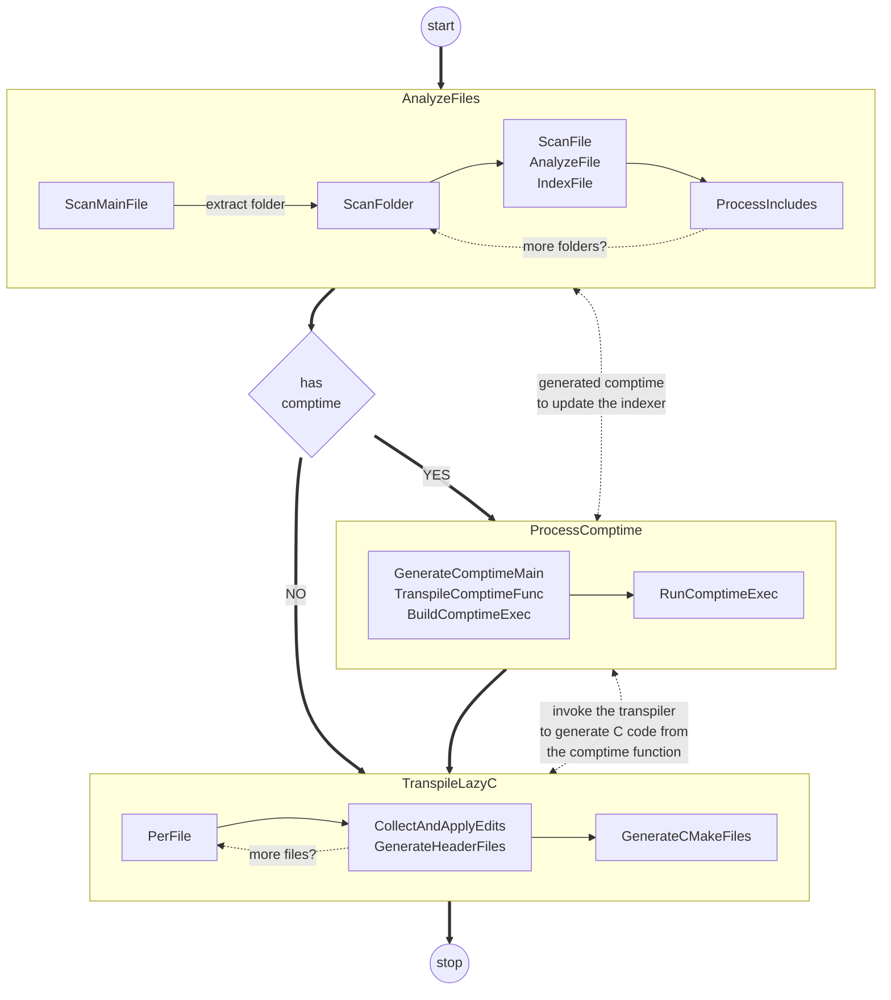
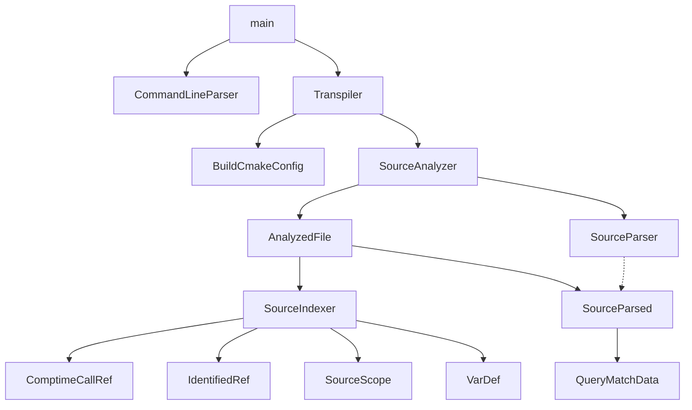

# MAIN FLOW

```mermaid
flowchart
  start((start))
  stop((stop))

  subgraph AnalyzeFiles["AnalyzeFiles"]
    ScanMainFile -->|"extract folder"| ScanFolder
    ScanFolder --> ScanFile["ScanFile
    AnalyzeFile
    IndexFile"]
    ScanFile --> ProcessIncludes
    ProcessIncludes -.->|"more folders?"| ScanFolder
  end

  subgraph ProcessComptime["ProcessComptime"]
    GenerateComptimeCode["GenerateComptimeMain
    TranspileComptimeFunc
    BuildComptimeExec"]
    GenerateComptimeCode --> RunComptimeExec
  end

  subgraph TranspileLazyC["TranspileLazyC"]
    PerFile --> TranspileFile["CollectAndApplyEdits
    GenerateHeaderFiles"]
    TranspileFile -.->|"more files?"| PerFile
    TranspileFile --> GenerateCMakeFiles
  end

  has_comptime{"has
  comptime"}

  start ==> AnalyzeFiles
  AnalyzeFiles ==> has_comptime
  has_comptime ==>|"NO"| TranspileLazyC
  has_comptime ==>|"YES"| ProcessComptime
  AnalyzeFiles <-.->|"generated comptime
  to update the indexer"| ProcessComptime
  ProcessComptime ==> TranspileLazyC
  ProcessComptime <-.->|"invoke the transpiler
  to generate C code from
  the comptime function"| TranspileLazyC
  TranspileLazyC ==> stop

```

# HIERARCHY

```mermaid

flowchart
  main --> CommandLineParser
  main --> Transpiler
  Transpiler --> BuildCmakeConfig
  Transpiler --> SourceAnalyzer
  SourceAnalyzer --> AnalyzedFile
  SourceAnalyzer --> SourceParser
  AnalyzedFile --> SourceIndexer
  SourceIndexer --> ComptimeCallRef
  SourceIndexer --> IdentifiedRef
  SourceIndexer --> SourceScope
  SourceIndexer --> VarDef
  AnalyzedFile --> SourceParsed
  SourceParsed --> QueryMatchData
  SourceParser -.-> SourceParsed

```
